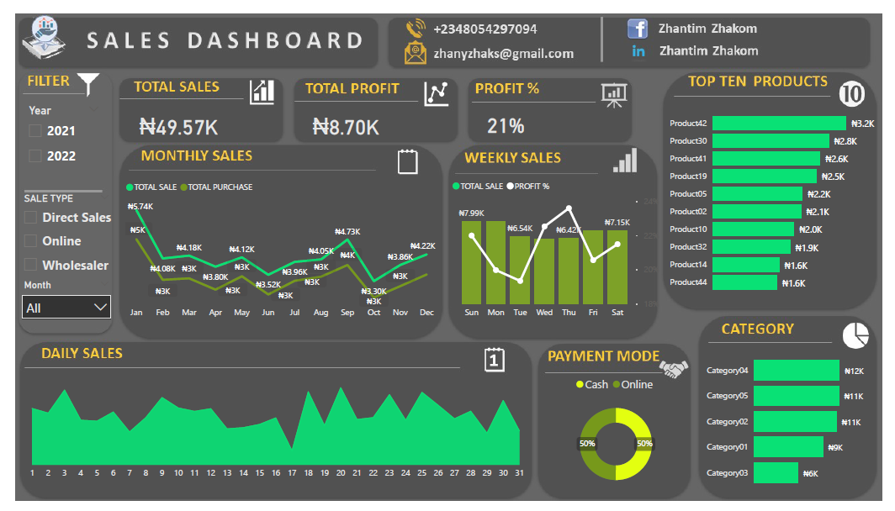

# 🧾 Sales Dashboard Project  

## 📊 Project Overview  
This project presents an interactive **Sales Dashboard** designed to visualize and analyze business sales performance data. The dashboard provides a comprehensive overview of key metrics such as **Total Sales**, **Total Profit**, **Profit Percentage**, and **Top-Performing Products**, enabling data-driven decision-making for sales and inventory management.  

---

## 🛠️ Tools & Technologies  
- **Microsoft Excel / Power BI** – for dashboard design and interactivity  
- **Dataset:** Simulated transactional sales data  
- **Skills Demonstrated:**  
  - Data cleaning and transformation  
  - DAX and Excel formula calculations for KPIs  
  - Dashboard layout and visualization design  
  - Dynamic filters and slicers for interactivity  

---

## 📈 Dashboard Features  
1. **Total Sales, Profit, and Profit % Indicators** – High-level KPIs summarizing performance.  
2. **Monthly and Weekly Sales Trends** – Line and column charts showing revenue progression and profit changes.  
3. **Daily Sales Analysis** – Area chart visualizing day-by-day sales volume.  
4. **Top 10 Products** – Ranked visualization of best-selling products.  
5. **Sales by Category** – Horizontal bar chart comparing total revenue across product categories.  
6. **Payment Mode Analysis** – Donut chart displaying the share of cash vs. online payments.  
7. **Interactive Filters** – Slicers for **Year**, **Sale Type**, and **Month** to explore data dynamically.  

---

## 💡 Key Insights  
- The business generated a **total sales value of ₦49.57K** and a **profit of ₦8.70K**, achieving a **profit margin of 21%**.  
- **Product42** ranked as the top-performing product with the highest sales value.  
- Sales were evenly split between **cash** and **online** payments (50% each).  
- Monthly sales trends indicated peak performance during **October** and moderate growth in **June**.  

---

## 🎯 Learning Outcomes  
- Gained hands-on experience in developing professional, interactive dashboards.  
- Strengthened ability to design and communicate business insights visually.  
- Enhanced proficiency in Excel/Power BI analytics and data storytelling.  

---

## 👤 Author  
**Zhantim Zhakom**  
📧 Email: [zhanyzhaks@gmail.com](mailto:zhanyzhaks@gmail.com)  
🌐 GitHub: [github.com/zhanyzhaks](https://github.com/zhanyzhaks)  
💼 LinkedIn: [linkedin.com/in/zhantim-zhakom](https://linkedin.com/in/zhantim-zhakom)

---

> **Note:** This project is part of my data analytics and visualization portfolio, demonstrating business reporting and KPI tracking skills.

## 📁 Project Structure  
